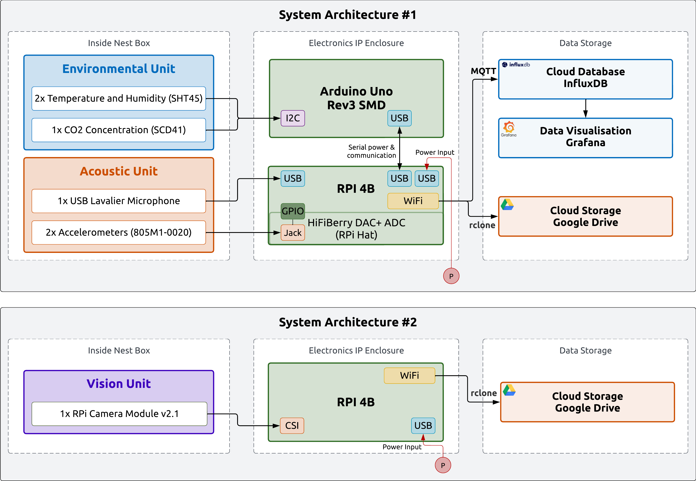
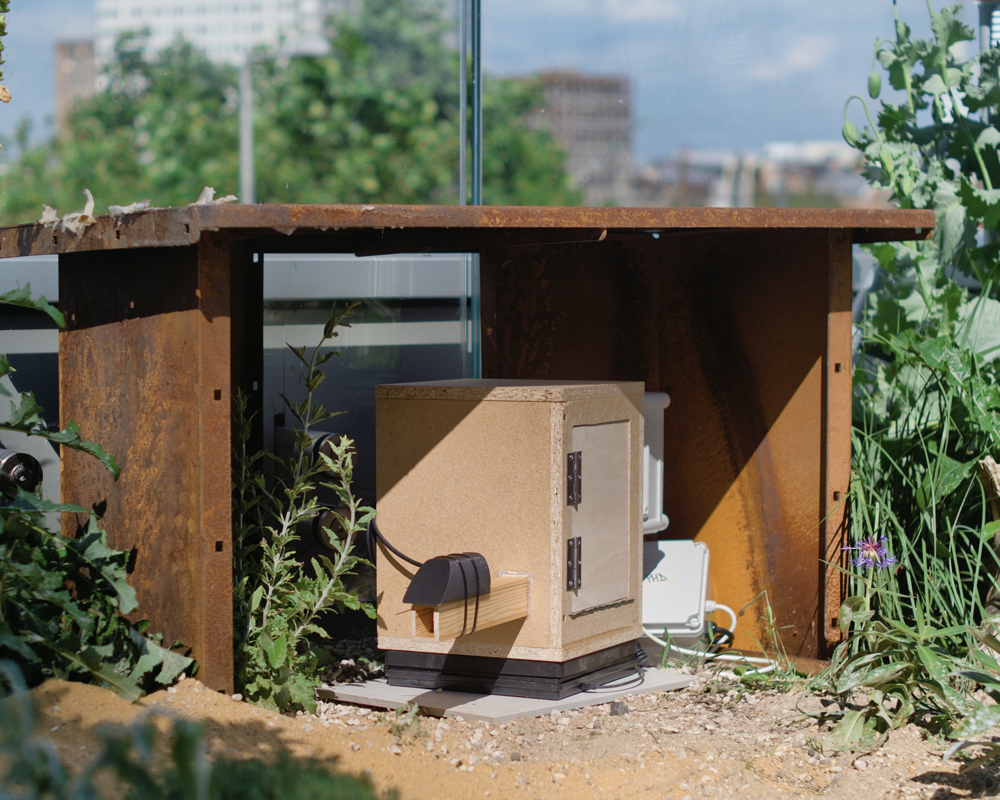
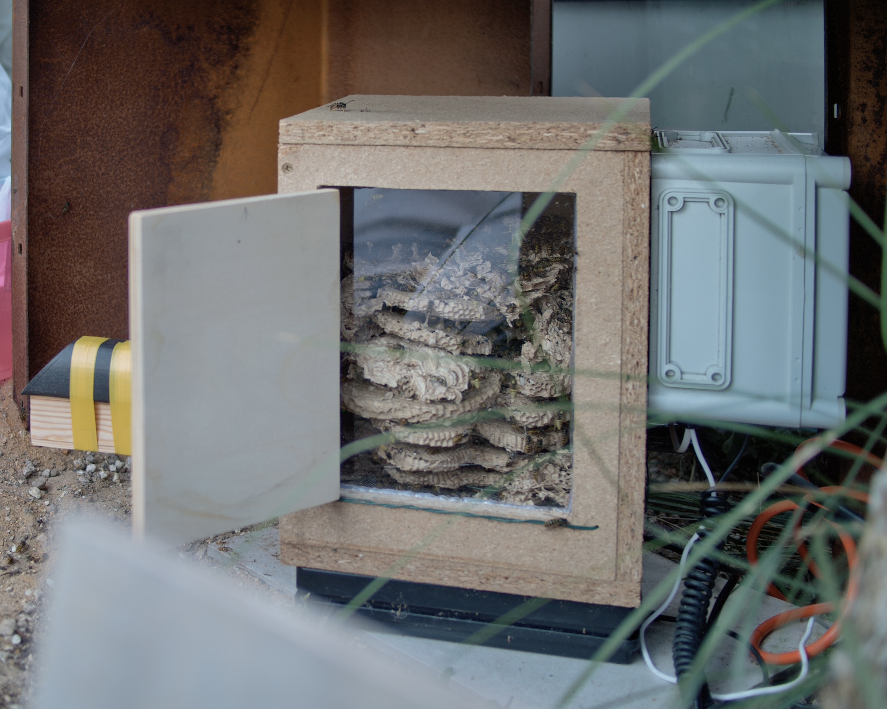

# Waspi IoT Monitoring System

Work in progress. Any questions, suggestions contact aude.vuilliomenet.18@ucl.ac.uk 

Waspi is a real-time monitoring system used to study the activity of wasp nests. The system is made of two parts; the environmental sensors node and the audio and vision logging node. 
#### Overview of the hardware system:
Waspi is built as a dual setup. A microcontroller (Arduino Uno) connects and reads the values from the sensors, while a more powerful single-board computer (Raspberry Pi 3B+) handles the communication functions. 

## Wasp Nest Env. Sensor Nodes

### Hardware
Microcontrollers 
- [Arduino Uno Rev3 SMD](https://store.arduino.cc/products/arduino-uno-rev3-smd?srsltid=AfmBOoofY5XkhblFjAWKUS3gzGJn89Rm5nvbwyBGmrwdyRFkwBVSKSeg)
- [Raspberry Pi 4B](https://www.raspberrypi.com/products/raspberry-pi-4-model-b/specifications/)

Sensors
- SHT45 Temperature and Humidity Sensor (Adafruit): [Adafruit Wiki](https://learn.adafruit.com/adafruit-sht40-temperature-humidity-sensor), [Sensirion SHT45 Datasheet](https://sensirion.com/resource/datasheet/sht4x)
- SCD41 CO2, Temperature and Humidity Sensor (DFRobot): [DFRobot Wiki](https://wiki.dfrobot.com/SKU_SEN0536_Gravity_SCD41_Infrared_CO2_Sensor) [Sensirion SCD41 Datasheet](https://sensirion.com/media/documents/48C4B7FB/66E05452/CD_DS_SCD4x_Datasheet_D1.pdf)
- 805M1-0020 Accelerometer (TE Connectivity): [TE Datasheet](https://tinyurl.com/2p9mrhd9)
- USB Lavalier Microphone: [MOVO USB-M1](https://www.movophoto.com/collections/usb-microphones/products/m1-usb-lav-lapel-condenser-computer-mic)
- [Raspberry Pi Camera Module v2.1](https://www.raspberrypi.com/products/camera-module-v2/)

Others
- HiFiBerry DAC+ ADC RPi Hat Sound Card: [Datasheet DAC+ ADC](https://www.hifiberry.com/docs/data-sheets/datasheet-dac-adc/)
- SBS-PT-50/2 [Weight Scale](https://www.amazon.co.uk/Steinberg-Systems-SBS-PT-50-Different-functions/dp/B01G713J94)
- HX711 Load Cell Amplifier: [Sparkfun](https://www.sparkfun.com/products/13879), [Datasheet](https://tinyurl.com/925rx3k2)

Power
- 100W Solar Panel: [TGR-PS-SP120](https://cpc.farnell.com/tiger-power-supplies/tgr-ps-sp120/portable-power-station-solar-panel/dp/PL16994)
- 320Wh Portable Power Station: [TGR-PS-300](https://cpc.farnell.com/tiger-power-supplies/tgr-ps-300/portable-power-station-300w-600w/dp/PL16991)

### Software
Due to the dual nature of the wasp nest monitoring system, waspi software is divided in two parts. The first is a single arduino C++ script to read the sensors values. The second part is made of a serie of python scripts to handle sensors' data retrieval, temporary data storage, and data communication. 

#### Overview of the software architecture

- Arduino Sensors Script [Arduino_waspi.ino](/arduino/arduino_waspi/arduino_waspi.ino)
- RaspberryPi IoT Scripts [src/waspi/components](/src/waspi/components)

### Enclosure
- Drawing and dimensions
- List of Materials (wood, insect mesh, garden wire)

### Setup
**Audio and Images: Files Transfer**
- Transfer audio and images to remote cloud storage (Google Drive) using [rclone](https://rclone.org/)
- Good Documentation about setting up rclone to migrate files to Google Drive:
    - rclone: [rclone Google Drive Docs](https://rclone.org/drive/), [Configuring rclone on headless machine](https://rclone.org/remote_setup/)
    - others: [Mounting GDrive on RPi - Medium Tutorial by Artur Klauser](https://medium.com/@artur.klauser/mounting-google-drive-on-raspberry-pi-dd15193d8138), [Github Wiki rclone4pi by Claude Pageau](https://github.com/pageauc/rclone4pi/wiki)
