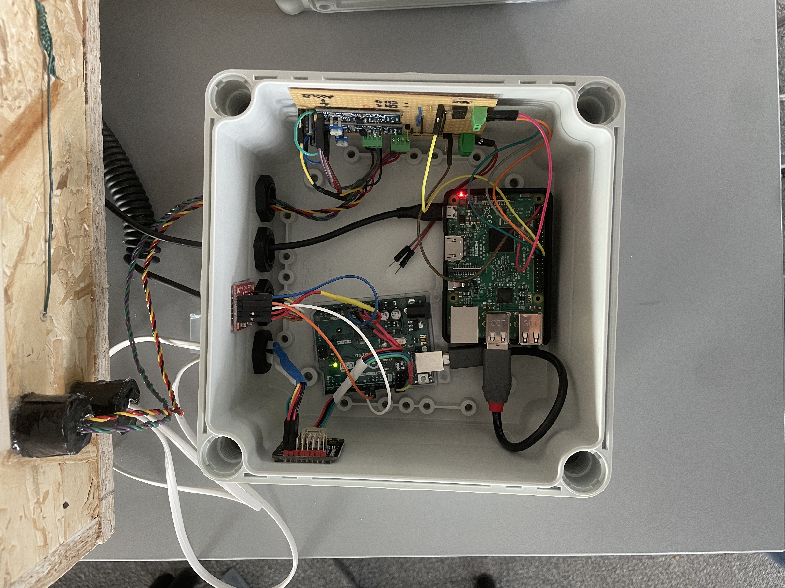
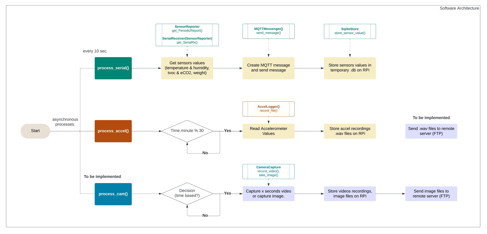

# Waspi IoT Monitoring System

Work in progress. Any questions, suggestions contact aude.vuilliomenet.18@ucl.ac.uk 

WasPi is a real-time monitoring system used to study the activity of wasp nests. The system is made of two parts; the environmental sensors node and the audio and vision logging node. 

#### Overview of the hardware system:
WasPi is built as a dual setup. A microcontroller (Arduino Uno) connects and reads the values from the sensors, while a more powerful single-board computer (Raspberry Pi 3B+) handles the communication functions. 

*Note: The diagram below is not an electronic schematic. It does not include the various electronic components needed for the sensors values to be read correctly such as amplifiers, ADC.*

 

## Wasp Nest Env. Sensor Nodes

### Hardware
Microcontrollers 
- Arduino Uno
- Raspberry Pi 3B+

Sensors
- SHT45 Temperature and Humidity Sensor (Adafruit): [Adafruit Wiki](https://learn.adafruit.com/adafruit-sht40-temperature-humidity-sensor), [Sensirion Datasheet](https://sensirion.com/resource/datasheet/sht4x)
- 805M1-0020 Accelerometer (TE Connectivity): [TE Datasheet](https://tinyurl.com/2p9mrhd9)
- SBS-PT-50/2 [Weight Scale](https://www.amazon.co.uk/Steinberg-Systems-SBS-PT-50-Different-functions/dp/B01G713J94)

Others
- LM386 Power Amplifier: [TI Datasheet](https://www.ti.com/lit/gpn/lm386)
- MCP3002 10-bit ADC: [Microchip Datasheet](https://ww1.microchip.com/downloads/aemDocuments/documents/APID/ProductDocuments/DataSheets/21294E.pdf)
- SBS-PT-50/2 [Weight Scale](https://www.amazon.co.uk/Steinberg-Systems-SBS-PT-50-Different-functions/dp/B01G713J94)
- HX711 Load Cell Amplifier: [Sparkfun](https://www.sparkfun.com/products/13879), [Datasheet](https://tinyurl.com/925rx3k2)

Power
- 100W Solar Panel: [TGR-PS-SP120](https://cpc.farnell.com/tiger-power-supplies/tgr-ps-sp120/portable-power-station-solar-panel/dp/PL16994)
- 320Wh Portable Power Station: [TGR-PS-300](https://cpc.farnell.com/tiger-power-supplies/tgr-ps-300/portable-power-station-300w-600w/dp/PL16991)

To be implemented
- SGP40 TVOC/eCO2 Sensor (Adafruit): [Adafruit Wiki](https://learn.adafruit.com/adafruit-sgp40), [Sensirion Datasheet](https://developer.sensirion.com/fileadmin/user_upload/customers/sensirion/Dokumente/9_Gas_Sensors/Datasheets/Sensirion_Gas_Sensors_Datasheet_SGP40.pdf)
- MEMS Microphone - [ICS-40190](https://www.sparkfun.com/products/18011), [VM2020](https://www.sparkfun.com/products/21537), [SPH0645LM4H](https://www.adafruit.com/product/3421) 
- Current & Power Sensor: [INA260 Adafruit Board](https://cdn-learn.adafruit.com/downloads/pdf/adafruit-ina260-current-voltage-power-sensor-breakout.pdf), [PAC1932 Microchip Datasheet](https://tinyurl.com/yxxvpz79) 

### Software
Due to the dual nature of the wasp nest monitoring system, waspi software is divided in two parts. The first is a single arduino C++ script to read the sensors values. The second part is made of a serie of python scripts to handle sensors' data retrieval, temporary data storage, and data communication. 

#### Overview of the software architecture

- Arduino Sensors Script [Arduino_waspi.ino](/arduino/arduino_waspi/arduino_waspi.ino)
- RaspberryPi IoT Scripts [src/waspi/components](/src/waspi/components)

### Enclosure
- Drawing and dimensions
- List of Materials (wood, insect mesh, garden wire)

### Setup
**Audio and Images: Files Transfer**
- Transfer audio and images to remote cloud storage (Google Drive) using [rclone](https://rclone.org/)
- Good Documentation about setting up rclone to migrate files to Google Drive:
    - rclone: [rclone Google Drive Docs](https://rclone.org/drive/), [Configuring rclone on headless machine](https://rclone.org/remote_setup/)
    - others: [Mounting GDrive on RPi - Medium Tutorial by Artur Klauser](https://medium.com/@artur.klauser/mounting-google-drive-on-raspberry-pi-dd15193d8138), [Github Wiki rclone4pi by Claude Pageau](https://github.com/pageauc/rclone4pi/wiki)

**MQTT - InfluxDB, Grafana Configuration**

